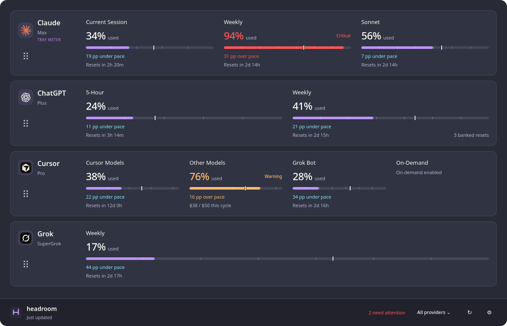

# Headroom

Headroom is a cross-platform tray app and terminal dashboard for monitoring
Claude, ChatGPT, Cursor, and Grok usage. The shared Qt interface shows every
usage meter returned by the bundled Go server, keeps the chosen provider order,
estimates pace within reset windows, and alerts when usage moves into Warning or
Critical.

[](https://github.com/AaronFeledy/headroom/actions/workflows/build.yml)
[](https://github.com/AaronFeledy/headroom/releases/latest)
[](LICENSE)



*Illustrative readings. Available meters vary by provider and plan.*

## Supported desktop packages

| Package | Tested baseline | Connection default |
| --- | --- | --- |
| Windows x64 | Windows 10 1809 or newer | Local managed server |
| Windows ARM64 | Windows 11 ARM64 | Local managed server |
| Linux x86_64 | Ubuntu 22.04 desktop ABI; X11 and Wayland plugins | Local managed server |
| macOS Apple Silicon | macOS 12+; native ARM64 | Local managed server |
| macOS Intel | macOS 12+; native x86_64 | Local managed server |

Official packages bundle Qt 6.8.3, the matching `usage-server`, and the stable
launcher/package manager. They also include the unified `headroom` CLI. CLI-only
packages support all five desktop targets plus Linux ARM64 without installing Qt.
Linux uses baseline system graphics, desktop, C++,
glibc, D-Bus, and OpenSSL libraries; the exact package list is in the
[package contract](packaging/README.md). Source builds support Qt 6.6 or newer.

## Install

The per-user installers select only the exact package for the current OS and
CPU, verify the release manifest, archive size, SHA-256 digest, inner manifest,
and every packaged file before changing the active installation.

Windows PowerShell 5.1 or newer:

```powershell
irm https://raw.githubusercontent.com/AaronFeledy/headroom/main/install.ps1 | iex
```

Linux x86_64 or macOS (Apple Silicon and Intel):

The shell installer requires `curl`, `tar`, and Python 3. On a Mac without
Python 3, install it first (for example, through Apple Command Line Tools or
your existing package manager).

```bash
curl -fsSL https://raw.githubusercontent.com/AaronFeledy/headroom/main/install.sh | sh
```

Current Headroom packages are available from
[v2.0.0](https://github.com/AaronFeledy/headroom/releases/tag/v2.0.0) onward.
Historical v1.x release records and tags remain for changelog history, but their
binary assets have been retired. The installers require a Headroom release
manifest and do not accept legacy executable releases. Existing Claude Usage
Widget users should follow the [upgrade guide](docs/upgrading-to-headroom.md)
for the one-time transition.

The published v2.0.0 app predates the repository rename, and its in-app updater
does not follow GitHub's redirect from the former release API. If **Check for
updates** reports that it did not complete, quit Headroom and run the current
installer above once to move to v2.0.1 or newer, then reopen it. Subsequent builds
use the canonical Headroom release endpoint.
See [desktop build instructions](clients/desktop/README.md) for source builds.

Windows installs under `%LOCALAPPDATA%\Headroom`, adds a Start menu shortcut,
and puts its `cli` directory on the current user's PATH.
Linux installs under `${XDG_DATA_HOME:-$HOME/.local/share}/headroom`, places the
CLI at `~/.local/bin/headroom`, and adds an application-menu entry pointing to
the separate desktop launcher.
macOS installs its managed files under `~/Library/Application Support/Headroom`
and creates a stable `~/Applications/Headroom.app` entry for Finder and login
startup. Mac packages are ad-hoc signed for code integrity; they are not yet
Developer ID signed or notarized by Apple. Use the installer for the managed
application rather than dragging the internal versioned bundle out of its archive.
Custom roots are supported by the installer options documented in
[packaging](packaging/README.md).

After installation, the installer starts the stable entry and accepts success
only when the selected immutable generation reports its exact executable,
version, PID, and private readiness nonce. If Headroom was already running, its
existing primary process remains untouched and the installer tells you to quit
that window and reopen the stable entry. `--no-launch`/`-NoLaunch` always prints
the same restart instruction and performs no activation attempt.

## Local and remote operation

Run `headroom` for terminal usage, `headroom desktop` for the tray app,
`headroom serve` for the server, or `headroom update` to update the installation.
See the [CLI guide](docs/cli.md) for flags, CLI-only installation, and coordinated
Windows/WSL updates.

```text
Local mode (default on Windows, macOS, and Linux)

  Headroom ── verified TLS when bundled ──> usage-server on localhost
      │                                  │
      │ starts and owns it only          └── provider credential files/APIs
      │ when no compatible server exists
      └── Windows helper may forward Cursor/Grok browser cookies in memory

Remote mode

  Headroom or Home Assistant ── HTTP(S) + optional bearer token ──>
      usage-server on WSL, a LAN host, NAS, Raspberry Pi, or container
```

Headroom probes the local endpoint without sending saved tokens. When it starts
the bundled server, the two processes establish a private session with a fresh
TLS certificate and bearer token. Headroom verifies that certificate on every
connection before sending authenticated requests or browser cookies. Session
secrets stay in memory and travel between parent and child through private pipes.
An existing plain HTTP server can supply usage without receiving a saved token
or browser cookies. To connect to an independently managed server that requires
a token, configure it explicitly in HTTP(S) settings; direct browser recovery
requires HTTPS. The SSH connection described below provides another encrypted
transport for Linux/WSL servers.

Headroom stops or hands off only a server process it started; attached and remote
servers remain independently owned. The standalone server binds to
`127.0.0.1:7823` by default and refuses any non-loopback bind without a bearer
token. Its existing HTTP API and configuration remain compatible.

Windows, macOS, and Linux start in Local mode at `http://127.0.0.1:7823`. Existing saved
connection settings take precedence over the default. **SSH is the recommended
remote option**; **HTTP(S)** remains available for direct connections. Browser
credential forwarding to a direct remote server requires HTTPS.

For a Linux or WSL backend with SSH access, choose **SSH** and use an address such
as `ssh://usageuser@server.example`. Headroom uses your existing OpenSSH keys and
trusted host configuration. Usage, version checks, and browser credential updates
travel through the encrypted connection to the running server's private socket;
no HTTPS certificate setup is needed for this mode. Enable `ssh_access: true` on
the backend first. See the [SSH setup guide](docs/ssh.md) for account requirements
and supported platforms. Headroom remembers the selected mode and never falls
back from SSH to HTTP.

## Migrate from Claude Usage Widget

Run the Headroom Windows installer once to switch from the old app. Its built-in
updater only recognizes `ClaudeUsageWidget-*.exe` assets and cannot install a
Headroom package. After this transition, Headroom's own package updater handles
future releases. The [upgrade guide](docs/upgrading-to-headroom.md) covers the
steps, preserved settings, server compatibility, and rollback.

On the first normal Windows launch, Headroom imports the legacy schema 0–3 file
at `%APPDATA%\ClaudeUsageWidget\settings.json` only when the new Headroom
settings file does not exist. It keeps the old file untouched and writes a
create-once backup beside the new settings. An empty legacy API URL remains
Local mode; a configured URL remains a direct HTTP(S) connection. The installer
stops the legacy executable at its standard installation path before launching
Headroom; quit portable or custom-path copies yourself.

Legacy settings and server paths, Go module/import paths, the `usage-server`
binary name, API provider value `Codex`, and API field names stay compatible.
The former `AaronFeledy/claude-usage-widget` repository URL redirects to the
canonical [AaronFeledy/headroom](https://github.com/AaronFeledy/headroom)
repository. Headroom displays `Codex` as **ChatGPT** while preserving the wire
identifier so existing servers, Home Assistant sensors, and saved order continue
to work. The [WinForms client](clients/windows/README.md) remains for reference
and rollback; it is not the default packaged UI.

## Settings, startup, and updates

Headroom stores settings atomically at:

- Windows: `%APPDATA%\Headroom\Headroom\settings.json`
- Linux: `${XDG_CONFIG_HOME:-$HOME/.config}/Headroom/Headroom/settings.json`
- macOS: `~/Library/Application Support/Headroom/Headroom/settings.json`

The file contains a remote bearer token in plaintext. Linux and macOS write it and its
migration backups with mode `0600`; Windows uses the current user's roaming app
data and inherited Windows access controls. Diagnostics retain at most 500
controlled, redacted events in memory and never record raw requests, response
bodies, tokens, URLs, provider credentials, or account output.

**Start Headroom when I sign in** registers the stable launcher, so an update
does not rewrite startup configuration. It uses the current user's Run entry on
Windows, an XDG autostart file on Linux, and a current-user LaunchAgent plist
on macOS. The Mac setting takes effect at the next login and never quits the
running app when disabled.

An official per-user install performs one delayed startup update check. When a
newer stable release exists, it automatically downloads and fully verifies the
matching package, then offers **Restart to apply**. Restart switches to a new
immutable generation, checks native readiness, and rolls back on failure. A
CLI-initiated update uses the same operation for the local desktop and server.
An explicitly paired Windows desktop and WSL server stage the same release on
both sides before applying it. For SSH connections, **Update server** in
**About & Updates** invokes the remote managed CLI and verifies the server's
version after restart. Direct HTTP(S) servers are updated manually on their
own host; the desktop shows a notice when it is newer than the connected server. A
trusted installation with a missing server or Windows credential helper can
stage an exact-version repair. Capture and explicit-config sessions do not
contact the public release service. Source
installs show the local rebuild guide; system packages defer to their package
manager.

## Providers and credentials

The server reads credentials on the host where it runs. All providers are
enabled by default and can be disabled in server YAML or environment settings.

- Claude: `~/.claude/.credentials.json`, Windows WSL discovery, or the OpenCode
  auth fallback.
- ChatGPT (`Codex` on the API): `CODEX_HOME/auth.json`, `~/.codex/auth.json`,
  Windows WSL discovery, or the OpenCode auth fallback.
- Cursor: local auth-file discovery, or an in-memory cookie/access-token push.
- Grok: `~/.grok/auth.json` or Windows WSL auth for the CLI billing endpoint;
  an in-memory browser `sso` cookie is a fallback.

Official Windows packages include a current-user credential helper for Cursor
and Grok browser cookies from supported Chrome, Edge, Brave, and Firefox
profiles. It uses the current Windows user's browser encryption context and
returns only the requested cookie over a bounded private child-process channel.
It cannot read another user's profile or bypass unsupported newer encrypted
values. Headroom forwards a result only to its verified bundled server session,
a configured HTTPS server, or the SSH receiver and never persists it. Linux and macOS do
not include this helper; use server-side credential files or the documented
[WSL credential sync](server/deploy/wsl/README.md).

## Interface behavior

Provider rows retain the server's labels, subtitles, status text, and up to 12
meters. Drag rows to reorder them; the first provider controls the tray ring and
tooltip. The shared warning state uses expected elapsed-window pace, remaining
allowance, low-capacity guards, and recovery thresholds. Reset times are known,
but period starts are not, so five-hour session, seven-day weekly, Cursor
30-day, and Grok calendar-month durations are labeled estimates. See the
[desktop guide](clients/desktop/README.md) for tray behavior, warning thresholds,
keyboard shortcuts, diagnostics, and disconnected behavior.

## Server and integrations

The server API remains compatible at `GET /api/v1/usage`; `current` and `weekly`
are retained fields and `buckets` carries variable provider meters. Details,
configuration precedence, flags, environment variables, and deployment samples
are in the [server guide](server/README.md).

- [Windows and Linux desktop](clients/desktop/README.md)
- [Package and updater contract](packaging/README.md)
- [Desktop parity and intentional differences](docs/desktop-parity.md)
- [WSL service deployment](server/deploy/wsl/README.md)
- [Home Assistant REST sensors](docs/home-assistant.md) — configuration only;
  this repository does not contain a Home Assistant add-on

## Build and verify

```bash
cmake -S clients/desktop -B clients/desktop/build -G Ninja -DCMAKE_BUILD_TYPE=Release
cmake --build clients/desktop/build --parallel
ctest --test-dir clients/desktop/build --output-on-failure -E headroom-reset-prohibited-tests

cd packaging/headroom-manager
go build ./...
go test -skip 'CodexResetEndpoint|ConsumeResetCredit|Reset' ./...
cd ../..

cd server
go test -skip 'CodexResetEndpoint|ConsumeResetCredit' ./...
go vet ./...
go build ./...
```

The reusable package workflow builds and smoke-tests five desktop targets and
six CLI targets from one validated version. It also retains the legacy C#
harness and server Go/race/vet/build/Docker workflows. See
[AGENTS.md](AGENTS.md) for the full contributor verification matrix.

## Troubleshooting

- If Local mode cannot start, open diagnostics and check whether Headroom
  attached to the loopback server, exhausted bounded restart attempts, or found
  a missing package component. An official trusted install offers
  **Repair installation** for a missing server or Windows helper; a source build
  needs a matching adjacent `usage-server`.
- A remote authorization error means the Headroom bearer token and server
  `auth_token`/`USAGE_AUTH_TOKEN` do not match. The app retains last good usage
  while retrying; saving corrected connection settings cancels old requests.
- **Copy sign-in command** only copies the server's suggested command (for
  Claude, `claude auth login`); it runs nothing. Run it as the user whose
  credentials the server reads, on the server host. For a Windows desktop using
  a WSL server, run it in WSL, not in a Windows terminal.
- If Linux starts without a tray, Headroom stays visible as a normal frameless
  window. Missing loader libraries should be compared with the Ubuntu 22.04
  runtime list in the [package contract](packaging/README.md).
- **Restart to apply** appears only for a complete verified stage. A failed
  candidate is stopped and the prior generation is restored; a
  `recovery_required` message means the next launch will retry recovery. If it
  remains, rerun the matching official installer, then quit and reopen Headroom.
- Diagnostics are session-local. Copy the redacted log before quitting if it is
  needed for a report; do not add bearer tokens or provider credentials.

## License

MIT
